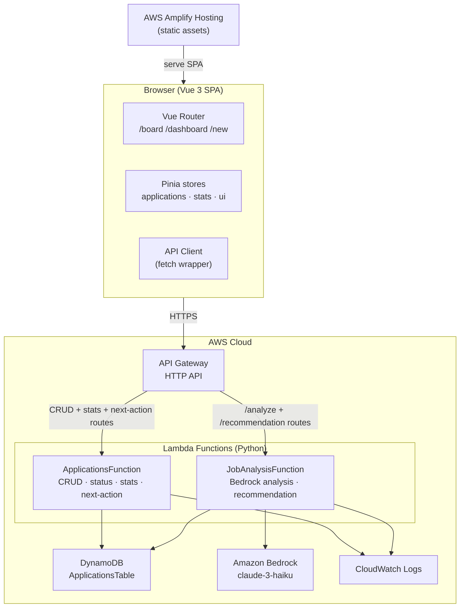
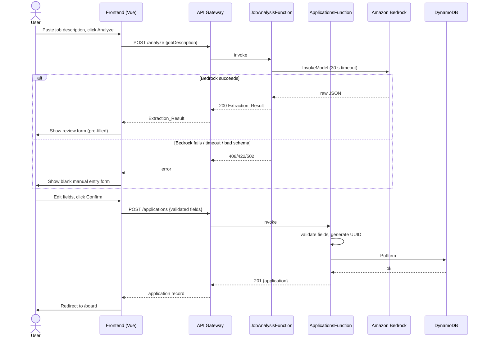
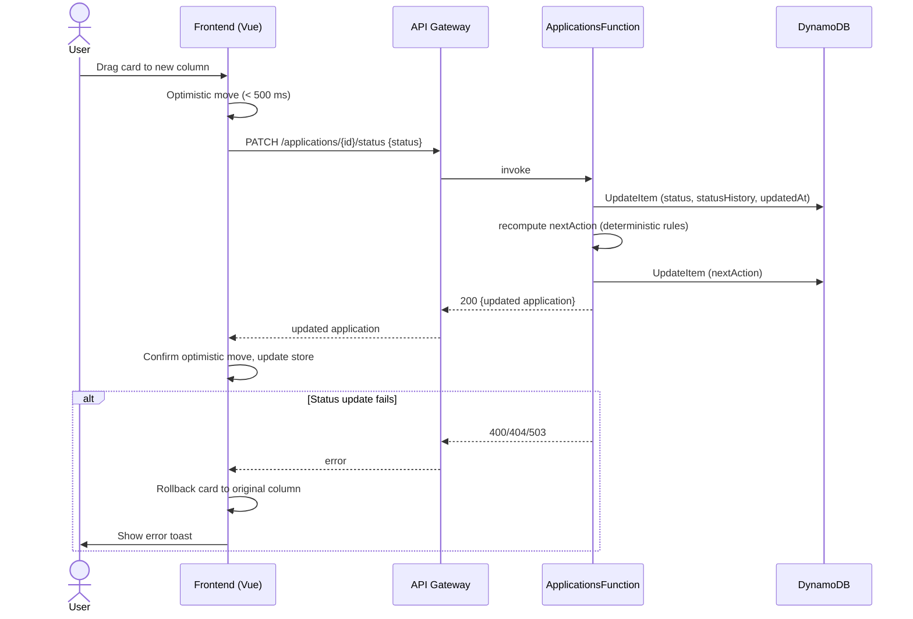
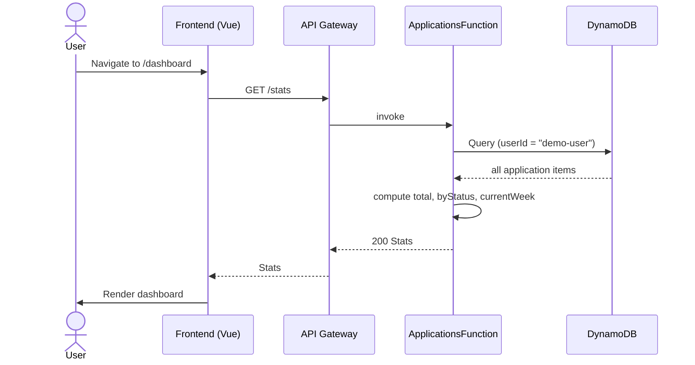

# Design Document — hire-desk-ai-mvp

## Overview

PROJECT_HIRE_DESK_AI is a single-page web application that allows a job seeker
to paste a job description, have Amazon Bedrock extract structured fields,
review and correct those fields, save the record to DynamoDB, and then track
every application on a Kanban board. A dashboard shows aggregated statistics
and a deterministic next-action engine guides the user through each step of the
application lifecycle.

**Scope of this document**

This document covers the complete technical design for the MVP: frontend
architecture, backend Lambda responsibilities, the HTTP API contract, the
DynamoDB schema, key data-flow sequences, the next-action business rules, error
handling, and the correctness properties that guide property-based testing.

**Key design decisions**

- All AWS calls (Bedrock, DynamoDB) happen exclusively in Lambda. The frontend
  never holds AWS credentials or identifiers.
- A single DynamoDB table keyed on `(userId, applicationId)` stores all
  application records. For the MVP, `userId` is always `"demo-user"`.
- The next-action engine is a pure deterministic Python function; Bedrock only
  contributes an optional ≤ 280-character explanation appended after the rule
  fires.
- Optimistic UI updates on the Kanban board are rolled back if the Lambda
  returns an error, keeping frontend and backend state consistent.
- The 30-second Bedrock timeout and the manual-entry fallback ensure the
  application remains usable even when AI analysis is unavailable.
- The backend is consolidated into two Lambda functions (`ApplicationsFunction` and `JobAnalysisFunction`) to minimise deployment, IAM, and maintenance overhead while keeping internal Python code modular through a handlers / services / repositories / validators / business-rules package structure.


---

## Architecture

### High-level system diagram



### Deployment model

- Frontend static assets are hosted on AWS Amplify Hosting.
- The backend is defined entirely in `template.yaml` (AWS SAM) and deployed
  with `sam deploy`. The template emits the API Gateway URL as an output.
- The backend is two Lambda functions. `ApplicationsFunction` handles all DynamoDB operations and deterministic business logic. `JobAnalysisFunction` handles all Bedrock calls. Both share a single IAM role per function with least-privilege policies scoped to their required services.


---

## Components and Interfaces

### Frontend components

#### Vue Router

Defines exactly three routes. Any unknown path redirects to `/board`.

| Route        | Component          | Purpose                        |
|-------------|-------------------|--------------------------------|
| `/board`     | `BoardView`        | Kanban board                   |
| `/dashboard` | `DashboardView`    | Aggregated statistics          |
| `/new`       | `NewApplicationView` | Job description entry & review |

#### Pinia stores

| Store                 | State                                              | Actions                                               |
|----------------------|----------------------------------------------------|-------------------------------------------------------|
| `applicationsStore`  | `applications[]`, `loading`, `error`               | `fetchAll`, `fetchOne`, `create`, `update`, `delete`, `updateStatus` |
| `statsStore`         | `stats`, `loading`, `error`                        | `fetchStats`                                          |
| `uiStore`            | `activeRoute`, `notifications[]`                   | `notify`, `clearNotification`                         |

#### API client

A thin `fetch` wrapper (`src/api/client.ts`) that:
- Prefixes all requests with the API Gateway base URL (read from
  `VITE_API_BASE_URL` at build time).
- Sets `Content-Type: application/json` on all POST/PATCH requests.
- Throws a typed `ApiError` on non-2xx responses so stores can handle it
  uniformly.
- Enforces a 30-second timeout on the `/analyze` call.

#### Key UI components

| Component             | Responsibility                                                   |
|----------------------|------------------------------------------------------------------|
| `NavBar`              | Persistent top bar; highlights active route link                 |
| `JobDescriptionForm`  | Textarea (max 10 000 chars) + "Analyze" button                   |
| `ExtractionReviewForm`| Editable form populated from `Extraction_Result`; "Confirm" CTA |
| `KanbanBoard`         | Renders five `KanbanColumn` components                           |
| `KanbanColumn`        | Lists `ApplicationCard` items; shows empty-state when 0 cards    |
| `ApplicationCard`     | Shows job title, company, status badge; drag handle              |
| `DashboardStats`      | Renders total, per-status, and weekly counts                     |
| `NotificationToast`   | Displays error/success messages from `uiStore`                   |


### Lambda deployment units

The backend is deployed as two Lambda functions. API Gateway routes multiple HTTP endpoints to the same function; each function uses an internal dispatcher to route to the correct handler module.

**ApplicationsFunction** — handles all application data operations and business logic.

| Handler module         | HTTP method & path                   | DynamoDB ops             |
|-----------------------|--------------------------------------|--------------------------|
| `create_application`   | `POST /applications`                 | PutItem                  |
| `list_applications`    | `GET /applications`                  | Query                    |
| `get_application`      | `GET /applications/{id}`             | GetItem                  |
| `update_application`   | `PATCH /applications/{id}`           | UpdateItem               |
| `delete_application`   | `DELETE /applications/{id}`          | DeleteItem               |
| `update_status`        | `PATCH /applications/{id}/status`    | UpdateItem               |
| `get_stats`            | `GET /stats`                         | Query                    |
| `get_recommendation`   | `GET /applications/{id}/recommendation` | GetItem (read-only)   |

**JobAnalysisFunction** — handles all Amazon Bedrock calls.

| Handler module   | HTTP method & path | Bedrock | DynamoDB ops |
|-----------------|--------------------|---------|--------------|
| `analyze_job`    | `POST /analyze`    | Yes     | None         |

Both functions:
- Read environment variables `TABLE_NAME` and `BEDROCK_MODEL_ID` injected by SAM.
- Use `boto3` with explicit error handling and structured logging to CloudWatch.
- Generate `applicationId` as a UUID v4 (never from the client).
- Reject any request body that includes `TableName`, `IndexName`, or similar DynamoDB identifiers.

#### Internal package structure

Both Lambda deployment packages share the same internal layout to keep logic modular:

```
backend/
  applications_function/
    app.py                  # Lambda entry point — dispatcher
    handlers/
      applications.py       # CRUD handlers
      status.py             # status-update handler
      stats.py              # dashboard stats handler
      recommendation.py     # next-action read handler
    services/
      applications_service.py
      stats_service.py
      recommendation_service.py
    repositories/
      applications_repo.py  # DynamoDB access layer
    validators/
      payload_validator.py
    business_rules/
      next_action_engine.py # compute_next_action() — pure function

  job_analysis_function/
    app.py                  # Lambda entry point — dispatcher
    handlers/
      analysis.py           # analyze_job handler
    services/
      bedrock_service.py    # Bedrock invocation + schema validation
    validators/
      extraction_validator.py
```

### API contract

#### Full endpoint table

| Method   | Path                                  | Request body / query    | Success response            | Error responses       |
|---------|---------------------------------------|-------------------------|-----------------------------|-----------------------|
| POST    | `/analyze`                            | `{jobDescription}`      | `200 Extraction_Result`     | `408`, `422`, `502`   |
| POST    | `/applications`                       | `Application fields`    | `201 {application}`         | `400`, `413`          |
| GET     | `/applications`                       | —                       | `200 [{application}]`       | `503`                 |
| GET     | `/applications/{id}`                  | —                       | `200 {application}`         | `404`                 |
| PATCH   | `/applications/{id}`                  | Partial fields          | `200 {application}`         | `400`, `404`          |
| DELETE  | `/applications/{id}`                  | —                       | `204`                       | `404`                 |
| PATCH   | `/applications/{id}/status`           | `{status}`              | `200 {application}`         | `400`, `404`          |
| GET     | `/stats`                              | —                       | `200 Stats`                 | `503`                 |
| GET     | `/applications/{id}/recommendation`   | —                       | `200 Next_Action_Recommendation` | `404`, `503`     |

#### Request / response schemas

**POST /analyze — request**
```json
{ "jobDescription": "string (≤ 10 000 chars)" }
```

**POST /analyze — success response (Extraction_Result)**
```json
{
  "jobTitle": "string | null",
  "company": "string | null",
  "location": "string | null",
  "skills": ["string"],
  "responsibilities": ["string"],
  "languages": ["string"],
  "experienceLevel": "string | null"
}
```

**POST /applications — request**
```json
{
  "jobTitle": "string (required, ≤ 500 chars)",
  "company": "string | null (≤ 500 chars)",
  "location": "string | null (≤ 500 chars)",
  "skills": ["string (≤ 200 chars)", "…"],
  "responsibilities": ["string (≤ 200 chars)", "…"],
  "languages": ["string (≤ 200 chars)", "…"],
  "experienceLevel": "string | null (≤ 500 chars)",
  "status": "Wishlist | Applied | Interview | Offer | Rejected"
}
```

**Application record (response shape)**
```json
{
  "userId": "demo-user",
  "applicationId": "uuid-v4",
  "jobTitle": "string",
  "company": "string | null",
  "location": "string | null",
  "skills": ["string"],
  "responsibilities": ["string"],
  "languages": ["string"],
  "experienceLevel": "string | null",
  "status": "Wishlist | Applied | Interview | Offer | Rejected",
  "createdAt": "ISO 8601",
  "updatedAt": "ISO 8601",
  "statusHistory": [{"status": "string", "timestamp": "ISO 8601"}],
  "nextAction": {
    "label": "string",
    "priority": "High | Medium | Low",
    "explanation": "string | null"
  }
}
```

**PATCH /applications/{id}/status — request**
```json
{ "status": "Wishlist | Applied | Interview | Offer | Rejected" }
```

**GET /stats — response**
```json
{
  "total": 12,
  "byStatus": {
    "Wishlist": 3, "Applied": 4, "Interview": 2,
    "Offer": 1, "Rejected": 2
  },
  "currentWeek": 3
}
```

**Next_Action_Recommendation**
```json
{
  "label": "Apply now",
  "priority": "High",
  "explanation": "string (≤ 280 chars) | null"
}
```


---

## Data Models

### DynamoDB table schema

**Table name:** `ApplicationsTable`
**Billing mode:** PAY_PER_REQUEST (on-demand)

| Attribute          | Type         | Key role       | Notes                                                    |
|-------------------|--------------|----------------|----------------------------------------------------------|
| `userId`          | String (S)   | Partition key  | Always `"demo-user"` in MVP                              |
| `applicationId`   | String (S)   | Sort key       | UUID v4 — generated by Lambda, never supplied by client  |
| `jobTitle`        | String (S)   |                | Required; ≤ 500 chars                                    |
| `company`         | String (S)   |                | Optional; ≤ 500 chars                                    |
| `location`        | String (S)   |                | Optional; ≤ 500 chars                                    |
| `skills`          | List (L)     |                | String items; ≤ 200 chars each; ≤ 30 items               |
| `responsibilities`| List (L)     |                | String items; ≤ 200 chars each; ≤ 30 items               |
| `languages`       | List (L)     |                | String items; ≤ 200 chars each; ≤ 30 items               |
| `experienceLevel` | String (S)   |                | Optional; ≤ 500 chars                                    |
| `status`          | String (S)   |                | Enum: Wishlist/Applied/Interview/Offer/Rejected          |
| `createdAt`       | String (S)   |                | ISO 8601 UTC timestamp                                   |
| `updatedAt`       | String (S)   |                | ISO 8601 UTC timestamp; updated on every write           |
| `statusHistory`   | List (L)     |                | List of `{status: S, timestamp: S}` maps                 |
| `nextAction`      | Map (M)      |                | `{label, priority, explanation?}`; null when no action   |

**Access patterns**

| Pattern                       | DynamoDB operation | Key condition                                  |
|------------------------------|-------------------|------------------------------------------------|
| List all for demo user        | `Query`           | `userId = "demo-user"` (scan forward=false)    |
| Get single application        | `GetItem`         | `userId = "demo-user"`, `applicationId = <id>` |
| Create application            | `PutItem`         | Full item; condition: attribute not exists     |
| Partial update                | `UpdateItem`      | Key + UpdateExpression for provided fields     |
| Delete                        | `DeleteItem`      | Key; condition: attribute exists               |
| Dashboard stats               | `Query`           | `userId = "demo-user"`, then aggregate in Lambda |

No secondary indexes are required for the MVP because the single demo-user
pattern only needs a full-partition scan plus key lookups.

### Python domain models

```python
from dataclasses import dataclass, field
from typing import Optional
from datetime import datetime
from enum import Enum

class Status(str, Enum):
    WISHLIST   = "Wishlist"
    APPLIED    = "Applied"
    INTERVIEW  = "Interview"
    OFFER      = "Offer"
    REJECTED   = "Rejected"

class Priority(str, Enum):
    HIGH   = "High"
    MEDIUM = "Medium"
    LOW    = "Low"

@dataclass
class StatusEntry:
    status: Status
    timestamp: datetime

@dataclass
class NextAction:
    label: str
    priority: Priority
    explanation: Optional[str] = None   # ≤ 280 chars; None when Bedrock unavailable

@dataclass
class Application:
    userId: str
    applicationId: str
    jobTitle: str
    status: Status
    createdAt: datetime
    updatedAt: datetime
    company: Optional[str] = None
    location: Optional[str] = None
    skills: list[str] = field(default_factory=list)
    responsibilities: list[str] = field(default_factory=list)
    languages: list[str] = field(default_factory=list)
    experienceLevel: Optional[str] = None
    statusHistory: list[StatusEntry] = field(default_factory=list)
    nextAction: Optional[NextAction] = None

@dataclass
class ExtractionResult:
    jobTitle: Optional[str]
    company: Optional[str]
    location: Optional[str]
    skills: list[str]
    responsibilities: list[str]
    languages: list[str]
    experienceLevel: Optional[str]

@dataclass
class DashboardStats:
    total: int
    byStatus: dict[str, int]
    currentWeek: int
```


### Key data-flow diagrams

#### Flow 1 — Analyze and save a new application



#### Flow 2 — Kanban status update with optimistic UI



#### Flow 3 — Dashboard statistics




---

## Next-Action Engine

The engine is a pure Python function with no I/O. It receives an `Application`
object and the current UTC datetime and returns `Optional[NextAction]`.

### Business rules

```python
from datetime import datetime, timezone, timedelta
from typing import Optional

def compute_next_action(app: Application, now: datetime) -> Optional[NextAction]:
    """
    Deterministic next-action computation.
    Bedrock explanation is NOT added here; it is appended by get_recommendation λ.
    """
    age_days = (now - app.createdAt).days
    days_since_update = (now - app.updatedAt).days

    # Detect whether a status change has occurred (history length > 1 means at
    # least one transition happened after creation).
    has_status_change = len(app.statusHistory) > 1

    match app.status:
        case Status.WISHLIST:
            if age_days > 7 and not has_status_change:
                return NextAction(label="Apply now", priority=Priority.HIGH)
            return None

        case Status.APPLIED:
            if days_since_update > 14 and not has_status_change:
                return NextAction(label="Follow up", priority=Priority.MEDIUM)
            return None

        case Status.INTERVIEW:
            return NextAction(label="Prepare for interview", priority=Priority.HIGH)

        case Status.OFFER:
            return NextAction(label="Review and respond to offer", priority=Priority.HIGH)

        case Status.REJECTED:
            return NextAction(label="Archive or reapply", priority=Priority.LOW)

        case _:
            return None
```

### Bedrock explanation attachment (JobAnalysisFunction — analysis handler)

1. Call `compute_next_action(app, now)`.
2. If result is `None`, return `{"nextAction": null}`.
3. Otherwise, call Bedrock through `bedrock_service.py` inside `JobAnalysisFunction` with a prompt:
   `"In ≤ 280 characters, explain why the user should {label} for this application in status {status}."`
4. If Bedrock succeeds and the explanation is ≤ 280 chars, attach it to
   `nextAction.explanation`.
5. If Bedrock fails, times out, or returns a response > 280 chars,
   return the `NextAction` with `explanation = null`.

### Recomputation on status change (ApplicationsFunction — status handler)

When a status change is persisted, `update_status` immediately calls
`compute_next_action` (without Bedrock) and writes the resulting
`nextAction` map back to DynamoDB. This keeps the stored record consistent
and ensures the board/list views show up-to-date recommendations without
extra round-trips.


---

## Correctness Properties

*A property is a characteristic or behavior that should hold true across all
valid executions of a system — essentially, a formal statement about what the
system should do. Properties serve as the bridge between human-readable
specifications and machine-verifiable correctness guarantees.*

**Property reflection summary**

After prework analysis, redundant properties were merged:
- 2.7 and 8.2 both describe Lambda field validation → merged into Property 4.
- 6.1 and 6.9 both describe the purity / determinism of the next-action engine → merged into Property 6.
- Requirements 6.2–6.6 and 6.11 all describe specific branches of the same pure function → merged into Property 7.
- 2.3 and 2.8 both describe the confirm-button gate on jobTitle → merged into Property 3.
- 3.1 and 3.3 both describe the create-then-get round-trip → merged into Property 5.

---

### Property 1: Job description input length gate

*For any* string submitted to the job-description input field, the input is
accepted if and only if its length is ≤ 10 000 characters; any string whose
length exceeds 10 000 characters is rejected before being sent to the API.

**Validates: Requirements 1.1**

---

### Property 2: Extraction_Result schema completeness

*For any* raw JSON payload returned by Amazon Bedrock, the schema validator
accepts the payload if and only if all required keys are present (`jobTitle`,
`company`, `location`, `skills`, `responsibilities`, `languages`,
`experienceLevel`); a payload missing any of these keys is rejected and the
manual-entry fallback is triggered.

**Validates: Requirements 1.3, 1.6**

---

### Property 3: Confirm button enabled iff jobTitle is non-empty

*For any* ExtractionReviewForm state, the confirm action is enabled if and only
if the `jobTitle` field contains at least one non-whitespace character; any
form state where `jobTitle` is empty or contains only whitespace keeps the
confirm action disabled.

**Validates: Requirements 2.3, 2.8**

---

### Property 4: Lambda field validation accepts iff all constraints satisfied

*For any* Application payload sent to `POST /applications` or
`PATCH /applications/{id}`, the Lambda accepts the request if and only if:
(a) `jobTitle` is non-empty,
(b) every string field is ≤ 500 characters,
(c) every list item is ≤ 200 characters,
(d) no list contains more than 30 items, and
(e) the payload contains no DynamoDB table or index identifiers.
Any payload violating at least one condition is rejected with HTTP 400 and the
response body identifies the specific failing field.

**Validates: Requirements 2.6, 2.7, 8.2, 8.3**

---

### Property 5: Create-then-read round trip preserves all fields

*For any* valid Application payload submitted to `POST /applications`, a
subsequent `GET /applications/{id}` using the returned `applicationId` returns
a record whose user-supplied fields (`jobTitle`, `company`, `location`,
`skills`, `responsibilities`, `languages`, `experienceLevel`, `status`) are
identical to the submitted values, and `applicationId` is a server-generated
UUID v4 absent from the original request.

**Validates: Requirements 3.1, 3.3**

---

### Property 6: Partial update preserves unmodified fields

*For any* existing Application record and any non-empty subset of its updatable
fields, a `PATCH /applications/{id}` request that contains only that subset
updates exactly those fields and leaves every other field unchanged, returning
the full updated record.

**Validates: Requirements 3.5**

---

### Property 7: List applications is ordered by creation date descending

*For any* collection of Application records stored for the demo user, `GET
/applications` returns a list where `createdAt` of each item is
greater-than-or-equal-to the `createdAt` of the item that follows it (i.e.,
sorted descending), and the list contains exactly the same number of items as
are stored.

**Validates: Requirements 3.2**

---

### Property 8: Each application card appears in the correct Kanban column

*For any* list of Applications with any distribution of Status values, the
board renders each application card in the column whose title matches the
application's `status`, and no card appears in more than one column.

**Validates: Requirements 4.2**

---

### Property 9: Invalid status value always returns 400

*For any* string value that is not one of `{Wishlist, Applied, Interview,
Offer, Rejected}`, a `PATCH /applications/{id}/status` request carrying that
value returns HTTP 400 and DynamoDB is not modified.

**Validates: Requirements 4.6**

---

### Property 10: Dashboard stats are consistent with application records

*For any* collection of Application records, the `compute_stats` function
returns a `DashboardStats` where:
(a) `total` equals the length of the collection,
(b) the sum of all values in `byStatus` equals `total`,
(c) each value in `byStatus` equals the count of records with that status, and
(d) `currentWeek` equals the count of records whose `createdAt` falls within
the current Monday 00:00 UTC – Sunday 23:59 UTC window.

**Validates: Requirements 5.1, 5.2, 5.3**

---

### Property 11: Next-action engine is deterministic and status-driven

*For any* `Application` object, `compute_next_action(app, now)` is a pure
function that returns the same result for the same `(status, createdAt,
updatedAt, statusHistory, now)` tuple regardless of all other fields.
Furthermore, the result satisfies all business rules simultaneously:

- `status = Wishlist`, age > 7 days, no status change → `{label: "Apply now", priority: High}`
- `status = Wishlist`, age ≤ 7 days, no status change → `None`
- `status = Applied`, days since update > 14, no status change → `{label: "Follow up", priority: Medium}`
- `status = Applied`, days since update ≤ 14, no status change → `None`
- `status = Interview` → `{label: "Prepare for interview", priority: High}`
- `status = Offer` → `{label: "Review and respond to offer", priority: High}`
- `status = Rejected` → `{label: "Archive or reapply", priority: Low}`
- any other status → `None`

**Validates: Requirements 6.1, 6.2, 6.3, 6.4, 6.5, 6.6, 6.9, 6.10, 6.11**

---

### Property 12: Bedrock explanation does not exceed 280 characters

*For any* `NextAction` returned by `get_recommendation`, if an AI-generated
explanation is attached, its length is ≤ 280 characters; any Bedrock response
that would produce an explanation longer than 280 characters is either
truncated or discarded, and the `NextAction` is returned without an
explanation rather than with an oversized one.

**Validates: Requirements 6.7**

---

### Property 13: Null Extraction_Result fields render as empty strings

*For any* `Extraction_Result` object, rendering it in `ExtractionReviewForm`
maps every field value of `null` to an empty string in the corresponding form
input, and every non-null string value renders as-is, so that all fields
remain editable regardless of Bedrock output.

**Validates: Requirements 1.4, 2.1**


---

## Error Handling

### Frontend error handling strategy

| Scenario                                  | User-visible behaviour                                           | Recovery path                         |
|------------------------------------------|------------------------------------------------------------------|---------------------------------------|
| `/analyze` returns error or timeout      | Toast: "Analysis failed. Enter details manually."                | Manual entry form is shown            |
| Bedrock schema validation fails (422)    | Toast: "Could not parse AI response. Enter details manually."    | Manual entry form is shown            |
| POST /applications returns 400           | Inline error on the review form; data is preserved              | User corrects and retries             |
| POST /applications returns 5xx           | Toast: "Save failed. Please try again."                          | Form stays open                       |
| Kanban status-update error               | Card reverts to original column; toast with error reason         | User can retry the drag               |
| GET /applications or GET /stats fail     | Error banner in the view; no stale data displayed               | User can refresh manually             |
| Navigation to unknown route              | Silent redirect to `/board`                                      | —                                     |

**Toast notification rules**
- Errors auto-dismiss after 5 seconds.
- If a new error arrives while one is displayed, it replaces the current toast.
- Error messages never include raw stack traces or AWS internals.

**Optimistic update rollback**
- The `applicationsStore.updateStatus` action saves the previous status before
  dispatching the PATCH request.
- If the request fails, the store reverts the `status` field and triggers a
  toast via `uiStore.notify`.

### Backend error handling strategy

#### Lambda error response format

All Lambda errors use a consistent JSON envelope:

```json
{
  "error": {
    "code": "VALIDATION_ERROR | NOT_FOUND | SERVICE_UNAVAILABLE | TIMEOUT | ...",
    "message": "Human-readable description (no raw user input)",
    "field": "fieldName (only for validation errors)"
  }
}
```

HTTP status mapping:

| Condition                          | HTTP status | Error code            |
|-----------------------------------|-------------|-----------------------|
| Field validation fails             | 400         | VALIDATION_ERROR      |
| DynamoDB/Lambda identifier in body | 400         | FORBIDDEN_FIELD       |
| Application not found             | 404         | NOT_FOUND             |
| Payload > 20 KB (API GW)          | 413         | PAYLOAD_TOO_LARGE     |
| Bedrock timeout (> 30 s)          | 408         | ANALYSIS_TIMEOUT      |
| Bedrock error / bad schema        | 422         | ANALYSIS_FAILED       |
| DynamoDB timeout (> 5 s)          | 503         | SERVICE_UNAVAILABLE   |
| Unexpected Python exception       | 500         | INTERNAL_ERROR        |

#### CloudWatch logging rules

- Every Lambda handler wraps its logic in a try/except and logs at least:
  `{requestId, errorCode, errorType, message}`.
- Raw user-supplied strings are NEVER written to logs. Field names may appear
  but not field values.
- Bedrock prompt templates are logged at DEBUG level (disabled in production
  by default via `LOG_LEVEL` environment variable).
- DynamoDB operation names and table name are logged; DynamoDB item content
  is not logged.

#### Bedrock resilience

- `JobAnalysisFunction` catches `botocore.exceptions.ClientError`
  and asyncio/threading timeout signals and returns the appropriate fallback
  (empty form or recommendation without explanation).
- No circuit breaker is required for the MVP; Bedrock errors are handled
  per-request.

#### DynamoDB resilience

- All DynamoDB calls use a 5-second boto3 socket/connect timeout via
  `botocore.config.Config(connect_timeout=5, read_timeout=5)`.
- On `ClientError` or timeout, the Lambda returns 503 immediately.
- No partial writes: DynamoDB PutItem and UpdateItem are atomic, so there is
  no risk of partial persistence for a single item.


---

## Testing Strategy

### Approach

The test suite uses pytest for all backend unit and integration tests, with Hypothesis for property-based testing of the deterministic next-action engine. Frontend tests use Vitest and Vue Test Utils. No fast-check or other frontend PBT library is required for the MVP.

The correctness properties defined in this document serve as validation objectives. Not every property requires a dedicated property-based test during the hackathon; example-based tests are acceptable for properties that are straightforward to cover with concrete cases.

### Backend — Python (pytest + Hypothesis)

Hypothesis is used selectively for `compute_next_action()` (Property 11) and `compute_stats()` (Property 10), where exhaustive enumeration would be impractical. All other tests use example-based pytest.

Tests are annotated with a comment linking them to the design property:
```
# Property 11: Next-action engine is deterministic and status-driven
```

| Test file                         | Coverage target                                        | Test type        |
|----------------------------------|--------------------------------------------------------|------------------|
| `test_next_action_engine.py`      | `compute_next_action()` — all status/age branches      | Hypothesis (PBT) |
| `test_compute_stats.py`           | `compute_stats()` — total, per-status, current-week    | Hypothesis (PBT) |
| `test_payload_validator.py`       | Field validation accept/reject (Property 4)            | pytest examples  |
| `test_extraction_validator.py`    | Bedrock schema validation (Property 2)                 | pytest examples  |
| `test_applications_handlers.py`   | CRUD handlers — happy path + error paths               | pytest + mocks   |
| `test_status_handler.py`          | Status update + next-action recompute                  | pytest + mocks   |
| `test_analysis_handler.py`        | Bedrock timeout, schema error, fallback                | pytest + mocks   |

**Key example-based scenarios:**
- Bedrock timeout → 408 response
- Bedrock schema mismatch → 422 response
- DynamoDB 5-second timeout → 503 response
- `applicationId` not found → 404 response
- Payload contains `TableName` → 400 FORBIDDEN_FIELD
- CloudWatch log output does not contain raw user field values
- `sam validate` passes for `template.yaml`

### Frontend — Vue 3 / TypeScript (Vitest + Vue Test Utils)

All frontend tests are example-based. No property-based testing library is required.

| Test file                        | Coverage target                                              |
|---------------------------------|--------------------------------------------------------------|
| `JobDescriptionForm.spec.ts`     | Input length gate (10 000 chars), submit disabled when empty |
| `ExtractionReviewForm.spec.ts`   | Confirm gate (jobTitle required), null → empty rendering     |
| `KanbanBoard.spec.ts`            | 5 columns rendered, card in correct column, empty-state      |
| `DashboardView.spec.ts`          | Stats displayed, error banner on fetch failure               |
| `routing.spec.ts`                | Unknown route → /board, active link highlighted              |
| `NavBar.spec.ts`                 | Links to all 3 routes, active route highlighted              |

**Key scenarios covered:**
- Board renders exactly 5 columns
- Each application card appears in the column matching its status
- Empty column shows empty-state indicator
- Kanban optimistic move fires PATCH; rollback shown on error
- Confirm button disabled while jobTitle is empty
- Manual entry form shown when /analyze returns 408 or 422
- Dashboard error banner shown when /stats fails
- Unknown route redirects to /board

### Integration tests (end-to-end smoke)

Run against a locally deployed SAM stack (`sam local start-api`):

1. POST /analyze with a sample job description
2. POST /applications → verify 201 and server-generated UUID
3. GET /applications → verify list contains new record, ordered by createdAt desc
4. PATCH /applications/{id}/status → verify status updated and nextAction recomputed
5. GET /stats → verify counts are consistent with stored records
6. DELETE /applications/{id} → verify success with no body
7. GET /applications/{id} after delete → verify 404

### Test file layout

```
backend/
  tests/
    unit/
      test_next_action_engine.py       # Hypothesis PBT — Property 11
      test_compute_stats.py            # Hypothesis PBT — Property 10
      test_payload_validator.py        # pytest examples — Property 4
      test_extraction_validator.py     # pytest examples — Property 2
      test_applications_handlers.py    # pytest + mocks — Properties 5, 6, 7, 9
      test_status_handler.py           # pytest + mocks — Properties 8, 11 (recompute)
      test_analysis_handler.py         # pytest + mocks — Properties 2, 12, 13
    integration/
      test_api_flows.py                # end-to-end smoke tests

frontend/
  src/
    __tests__/
      JobDescriptionForm.spec.ts       # Properties 1, 3 (examples)
      ExtractionReviewForm.spec.ts     # Properties 3, 13 (examples)
      KanbanBoard.spec.ts              # Property 8 (examples)
      DashboardView.spec.ts            # examples
      routing.spec.ts                  # examples
      NavBar.spec.ts                   # examples
```

