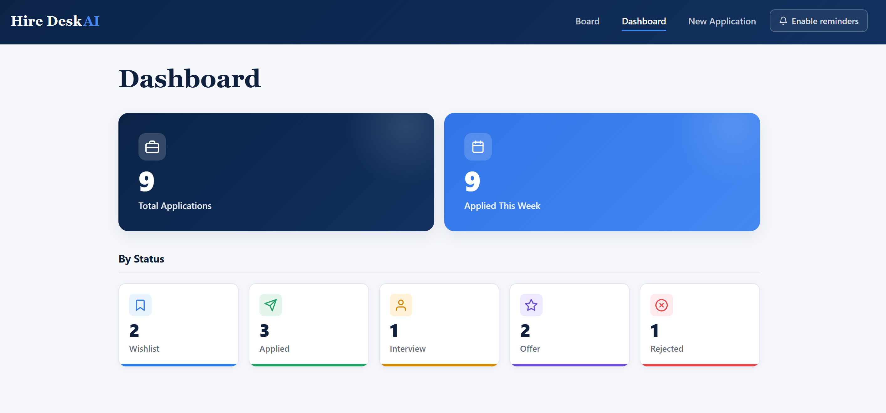
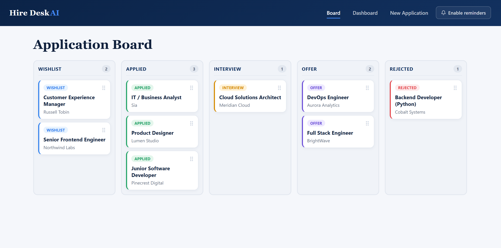
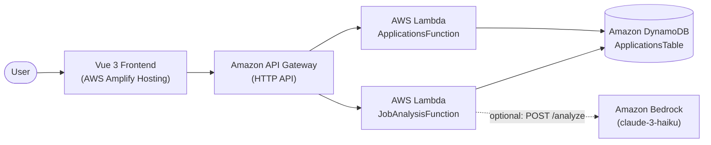

# Hire Desk AI

Hire Desk AI is a cloud-native job application tracking MVP that helps job seekers
organize, analyze, and track their job applications through a clear, structured workflow.

> **Demo links (TODO placeholders — not yet available):**
>
> - **Live demo:** _TODO — add the deployed application URL._
> - **Demonstration video:** _TODO — add the demo video link._
> - **Screenshots:** _TODO — add images under_ `docs/screenshots/`, _for example:_
>
>   
>   

## Overview

Hire Desk AI is a cloud-native job application tracking MVP. It centralizes the
job-search process into a single dashboard where a user can capture a job
description, review the extracted information, save an application, and follow its
progress on a Kanban board with a recommended next action.

## Problem

Managing several job applications at once is hard. Candidates struggle to keep
track of multiple applications, their current statuses, upcoming deadlines,
follow-ups to send, and the important information contained in each job
description. This information tends to be scattered across spreadsheets, notes,
and email threads.

## Solution

Hire Desk AI brings the workflow together in one place:

- A centralized dashboard for all applications.
- A Kanban workflow to move applications between statuses.
- An application details view for reviewing the captured information.
- A calendar view for date-based insights.
- Browser reminders to help stay on top of follow-ups.
- Assisted job-description extraction to speed up data entry, with a manual
  fallback when the assisted analysis is unavailable.

## Main Features

Only the features below are implemented in this MVP:

- Application creation.
- Kanban status management.
- Drag-and-drop status updates.
- Dashboard statistics.
- Application details modal.
- Application calendar.
- Browser reminders.
- Next-action recommendations (deterministic, rule-based).
- Manual fallback when AI analysis is unavailable.
- DynamoDB persistence.

## Application Workflow

1. Paste a job description.
2. Analyze it via the backend (`POST /analyze`).
3. Review the extracted fields.
4. Use the manual fallback when analysis is unavailable.
5. Save the application (`POST /applications`).
6. Track it on the Kanban board.

## Architecture



The Vue 3 frontend (served through AWS Amplify Hosting) talks only to the Amazon
API Gateway HTTP API. API Gateway routes requests to two AWS Lambda functions,
which read and write application data in Amazon DynamoDB. The `JobAnalysisFunction`
optionally calls Amazon Bedrock for job-description analysis on the `POST /analyze`
route. The frontend never calls DynamoDB or Bedrock directly.

## AWS Services

This project uses the following AWS services:

- **Amazon API Gateway (HTTP API):** the single entry point for all client
  requests. The stage is `$default`, and CORS allows the local dev origins
  `http://localhost:5173` and `http://127.0.0.1:5173`.
- **AWS Lambda:** two functions on the `python3.13` runtime (512 MB, x86_64):
  - `ApplicationsFunction` — application CRUD, status updates, statistics, and
    next-action recommendations.
  - `JobAnalysisFunction` — job-description analysis and recommendation retrieval.
- **Amazon DynamoDB:** a single `PAY_PER_REQUEST` table keyed by `userId`
  (partition key) and `applicationId` (sort key).
- **Amazon Bedrock:** `InvokeModel` against the Anthropic Claude 3 Haiku model
  (`anthropic.claude-3-haiku-20240307-v1:0`), used by the `JobAnalysisFunction`.
- **AWS IAM:** least-privilege policies declared in the SAM template scope each
  function to the resources it needs.
- **AWS Amplify Hosting:** builds and serves the frontend using `amplify.yml`.
- **AWS CloudFormation:** the SAM template defines and deploys the backend stack;
  `amplify.yml` reads stack outputs via `describe-stacks`.

AWS Lambda writes function logs to Amazon CloudWatch by default.

## Technology Stack

### Frontend

- Vue 3
- TypeScript
- Vite
- Pinia
- Vue Router

### Backend

- Python 3.13
- AWS Lambda
- boto3

### Cloud / Infrastructure

- AWS SAM
- Amazon API Gateway (HTTP API)
- Amazon DynamoDB
- Amazon Bedrock
- AWS IAM
- AWS Amplify Hosting
- AWS CloudFormation

### Testing

- **Frontend:** Vitest, `@vue/test-utils`, jsdom, vue-tsc
- **Backend:** pytest, pytest-cov, hypothesis, moto

## Project Structure

```text
project_hire_desk_ai/
├── frontend/                       # Vue 3 + TypeScript client (Vite)
│   └── src/
│       ├── api/                    # Backend API client
│       ├── components/             # UI components
│       ├── composables/            # Reusable composition functions
│       ├── stores/                 # Pinia stores
│       ├── views/                  # Route-level views
│       ├── router/                 # Vue Router configuration
│       ├── assets/                 # Static assets
│       ├── __tests__/              # Frontend tests
│       ├── App.vue
│       └── main.ts
├── backend/
│   ├── applications_function/      # Lambda: CRUD, status, stats, recommendation
│   │   ├── app.py                  # Dispatcher (Handler: app.handler)
│   │   ├── models.py
│   │   ├── business_rules/         # Deterministic next-action logic
│   │   ├── handlers/
│   │   ├── repositories/
│   │   ├── services/
│   │   ├── validators/
│   │   └── requirements.txt
│   ├── job_analysis_function/      # Lambda: job-description analysis
│   │   ├── app.py                  # Handler: app.handler
│   │   ├── models.py
│   │   ├── handlers/
│   │   ├── services/
│   │   ├── validators/
│   │   └── requirements.txt
│   ├── tests/
│   │   ├── unit/                   # Unit + property-based tests
│   │   └── integration/            # Placeholder (not yet implemented)
│   ├── requirements.txt            # Runtime deps (boto3, botocore)
│   └── requirements-dev.txt        # Dev/test deps
├── scripts/
│   └── seed_demo_data.py           # Seeds sample applications via the API
├── template.yaml                   # AWS SAM infrastructure definition
├── samconfig.toml                  # SAM deploy configuration
├── amplify.yml                     # Amplify Hosting build spec
└── .kiro/specs/hire-desk-ai-mvp/   # Spec: requirements, design, tasks
```

## Local Development

**Prerequisites:** Node.js (for the frontend) and Python 3.13 (for the backend).

### Frontend

```bash
cd frontend
npm install
npm run dev
```

`npm run dev` starts the Vite dev server. The frontend reads the backend base URL
from the `VITE_API_BASE_URL` environment variable, which must point to your backend
API base URL. You can provide it via a local `.env` file (do not commit secrets):

```bash
# frontend/.env
VITE_API_BASE_URL=https://<your-api-id>.execute-api.<region>.amazonaws.com
```

### Backend

Create and activate a virtual environment, then install the dev/test dependencies:

```bash
python -m venv .venv
# Windows PowerShell:
.venv\Scripts\Activate.ps1
pip install -r backend/requirements-dev.txt
```

Optionally, you can run the API locally with AWS SAM:

```bash
sam build
sam local start-api
```

## Testing

> Test counts are not asserted here — the commands below describe how to run the
> suites.

Frontend (from `frontend/`):

```bash
npx vitest run       # unit / component tests
npx vue-tsc --noEmit # type checking
npx vite build       # production build check
```

Backend Python unit tests (from the repository root):

```bash
python -m pytest backend/tests/unit/ -v
```

Infrastructure checks:

```bash
sam validate --lint
sam build
```

Some backend unit tests use property-based testing (hypothesis). The
`backend/tests/integration/` directory is currently a placeholder and does not
yet contain integration tests.

## AWS Deployment

Deploy the backend with AWS SAM:

```bash
sam build
sam deploy
```

Deployment settings are read from `samconfig.toml`:

- Stack name: `hire-desk-ai-mvp`
- Region: `eu-west-1`
- Capabilities: `CAPABILITY_IAM`
- Parameter overrides: `BedrockModelId=anthropic.claude-3-haiku-20240307-v1:0`
  and `LogLevel=INFO`

A SAM CLI profile and an S3 artifact bucket are also configured in
`samconfig.toml`; adjust these to match your own AWS account and profile.

The frontend is deployed via AWS Amplify Hosting using `amplify.yml`. During the
build, Amplify retrieves the `ApiUrl` output from the CloudFormation stack
`hire-desk-ai-mvp` (region `eu-west-1`) and injects it as `VITE_API_BASE_URL`
before running the frontend build. The build fails fast if that value is empty.

The stack exposes an `ApiUrl` output of the form
`https://${HttpApi}.execute-api.${AWS::Region}.amazonaws.com`.

## Demo Data

To populate the board and dashboard with sample (fictional) applications, use
`scripts/seed_demo_data.py`. It reads the deployed API base URL from the
`API_BASE_URL` environment variable and POSTs several sample applications to
`<base>/applications`. The script only performs POST requests (it never deletes
data) and exits with a non-zero status if any request fails.

PowerShell:

```powershell
$env:API_BASE_URL = "https://<your-api-id>.execute-api.<region>.amazonaws.com"
python scripts/seed_demo_data.py
```

## Known Limitation: Anthropic model access

The Amazon Bedrock integration is implemented, and analysis requests reach the
deployed Lambda function as expected. During final testing, a direct AWS CLI
invocation confirmed that the AWS account had not yet submitted the Anthropic
first-time use-case details required for model access, so Bedrock returned a
`ResourceNotFoundException`.

This is an AWS account-level model-access prerequisite, not a frontend routing or
request-payload defect. Hire Desk AI remains fully usable through its manual
fallback while model access is being activated.

## Security and Privacy

- Secrets are excluded from the repository via `.gitignore`.
- IAM permissions are managed in the SAM template (`template.yaml`).
- Job descriptions are sent to the backend for analysis.
- This is a hackathon MVP, not a production recruitment decision system.

## Future Improvements

- Complete the Anthropic account activation for Bedrock model access.
- Add authentication.
- Add multi-user data isolation.
- Add editing and deletion flows.
- Add stronger observability.
- Add an automated deployment pipeline.
- Improve accessibility.

## Hackathon Context

Hire Desk AI was developed as an AWS / Kiro hackathon MVP.

## License

This project is licensed under the [MIT License](LICENSE).

Copyright © 2026 Fredy Rodriguez.
